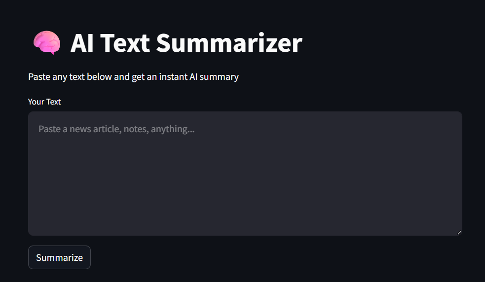

# 🧠 AI Text Summarizer

Paste any long text and instantly get:
- A clean 3-sentence summary
- 3 key takeaways  
- Sentiment analysis

## Built With
- Python
- Streamlit
- Google Gemini API

## How to Run
1. Clone the repo
2. pip install -r requirements.txt
3. Add your Gemini API key to .env
4. streamlit run app.py

## Project live link
https://saraa2006-ai-text-summarizer.hf.space/
